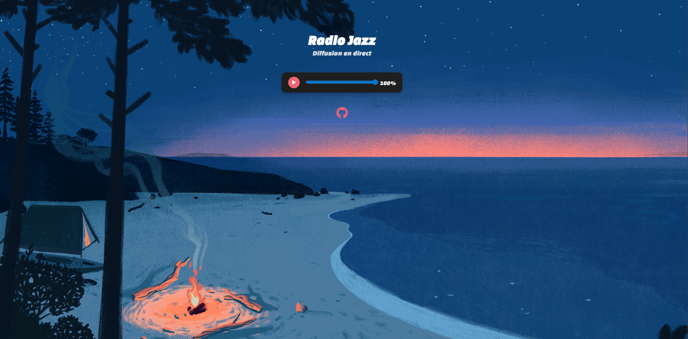

# 🎷 Jazz Radio — Live Radio Player

A simple website that lets you listen to live Jazz music.

## Screenshot



---

## Features
- Play/Pause button  
- Volume control  

---

## Project Structure
```
/
├── index.html
├── src/
│   ├── css/
│   │   └── radio.css
│   └── js/
│       └── radio.js
```


---

## Installation & Usage

1. Clone the project:
   ```bash
   git clone https://github.com/itsSayte/Jazz-radio
    ```
2. Open index.html in your browser.

## Technologies Used
- HTML5
- CSS3
- JavaScript
- Font Awesome
- Live MP3 stream

## Radio Stream Used
[Radio Swiss Jazz](https://stream.srg-ssr.ch/m/rsj/mp3_128)